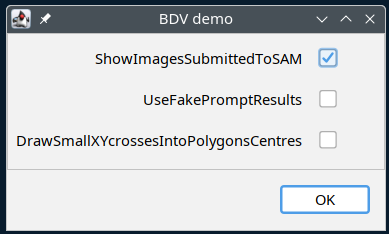

# SAMJ-BDV
**(EXPERIMENTAL)**

A [BigDataViewer](https://imagej.net/plugins/bdv/) interface for the [SAMJ workhorse](https://github.com/segment-anything-models-java/SAMJ).

### Wanna try at home?
- Grab some Fiji that has SAMJ installed (hint: enable SAMJ Fiji update site).
- Grab this [`.jar file`](https://raw.githubusercontent.com/segment-anything-models-java/SAMJ-BDV/releasing-demo/samj-BDV-0.0.1-SNAPSHOT.jar) and copy it into your `Fiji.app/jars` folder.
- Open some 3D(!) image (breaks currently with 2D images, blame `xulman`).
- Go Fiji -> Plugins -> SAMJ -> BDV Demo

The two options are:

- `ShowImagesSubmittedToSAM` - will show in ImageJ the image that is submitted to the network; useful to understand what's the scope of data that the network will see and use, also to be able to test the "standard" SAMJ on it.
- `UseFakePromptResults` - the prompts from BDV will never make it to any network (no matter what you click later), instead fake results are directly returned; this is a mode for getting familiar first with the BDV and SAMJ integration itself.
- `DrawSmallXYcrossesIntoPolygonsCentres` - the results of prompts (which are polygons) will be "marked" in the original image with a black cross in each polygon centre; this is a lame proof that [plugins can read the polygons back from BDV](https://github.com/segment-anything-models-java/SAMJ-BDV/blob/344f197a36bf098f99a62cfd2fb57dd71c21ddde/src/main/java/ai/nets/samj/bdv/ij/PluginFrontEnd.java#L37-L74).

### The concept of annotation sites
Since BigDataViewer (BDV) can display images much larger than SAM networks can consume, the BDV is considered to be "only" an explorer of the image data that allows the user to maneuver, or obtain, a particular (2D) view on the image data. The 2D views, the displayed content on the screen, of the potentially larger 3D+ volume and the ability to change the views is an important concept here. The integration layer (this SW) of BDV with SAMJ is memorizing the user-defined views, which are called here **annotation sites**, and allows to recall and switch them, and of course annotate them.

The integration with SAMJ then works as follows:
- User chooses a view on the image and **presses `A`** to start annotating this view, to **create a new annotation site**.
  - **Annotation site** is established this way, and memorized.
  - The site will be available and listed in the main SAMJ dialog.
  - The pixels (unaltered, original image values) present in the current view will comprise an image that's subjected to the segmentation network.
- When the site is activated in the SAMJ main dialog, by choosing it and pressing the "Go!" button, one can start inserting the prompts in the BDV.
  - Note that the linking between BDV and the SAMJ dialog is currently rather weak: If one visits a different annotation site in BDV, or "goes" another site in SAMJ dialog, the other side will not notice (subject to fix in the future), and prompts will behave weirdly...
  - **Prompts are inserted with `L`**: point mouse on one corner, press and hold 'L', move mouse (w/o clicking a button) to where the opposite corner should be, release 'L', done -> prompt is sent, the result shall be displayed eventually.
- One can **still move freely within the image data**.
  - This actually means changing the views, and especially losing the view of the annotation site.
  - BDV is not trying to understand if one is looking again at some annotation site (subject to change), one has to explicitly **recall annotation site**:
    - With **`shift W`** the **last used annotation site** is restored, the view comes back, and its content is displayed.
    - With **`W`** one can **circulate through annotation sites**.
   
### Current limitations
- Annotations cannot be saved/exported. You're creating them now only because you're curious :-)
- **Annotation sites** must be views strictly along some of the axes, use **`Shift+Z`** or **`Shift+X`** or **`Shift+Y`** to obtain a view along the respective axis.
- This is **always 2D annotations** despite happening in volume data.
- Obtained results of the prompts cannot be deleted, hidden, anything. Their management comes next.
- Display of annotation sites content currently permits to display exactly one annotation site (even when you create two overlapping), this will also be changed soon(TM)!
- Management of the annotations sites, or their content, is still missing. Also any communication happens only via console, it's **advised to monitor Fiji -> Window -> Console**.
- ...there must be more, [do let us know here, please](https://github.com/segment-anything-models-java/SAMJ-BDV/issues).

### Current specialties
- Try to create an annotation site with **`shift A`** (instead of `A`), the view that is marshaled to the network is modified according to the current image data visibility settings of BDV (that's the panel on the right, try pressing `P` to have it opened), one can thus e.g. increase contrast and let the networks operate on such image. The change happens aside (and one can study it if you enable `ShowImagesSubmittedToSAM`), the original image is never changed.

Enjoy!

*Collaborators (Java programmers) are welcome! Contact vladimir.ulman na vsb.cz.*
